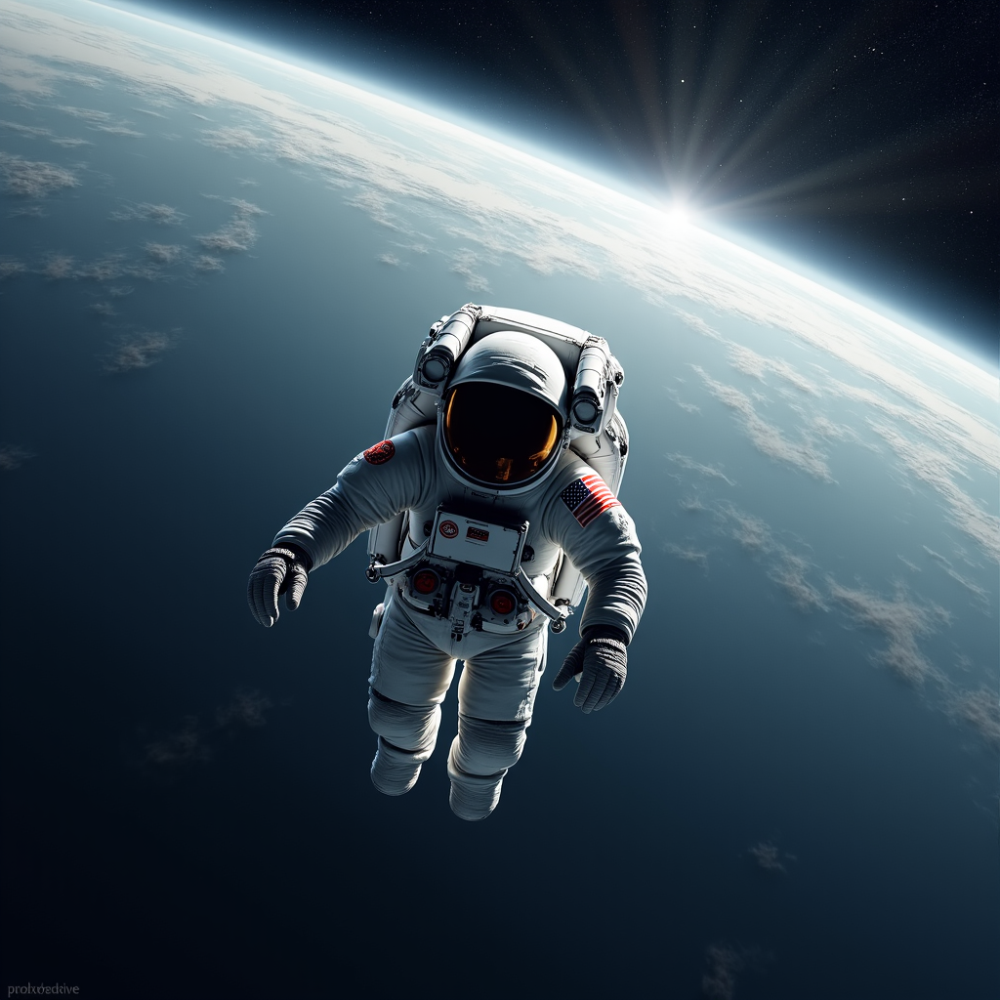

# FLUX-MultiKeyframe-SVD
Advanced Multimodal AI Generation System: FLUX.1-dev with Multi-Keyframe Motion Synthesis for Computer Vision
# 🎨 FLUX + Multi-Keyframe SVD: Advanced Multimodal AI Generation

[](https://www.python.org/downloads/)
[](https://pytorch.org/)
[](https://opensource.org/licenses/MIT)
[](https://colab.research.google.com/github/Sarang-More/FLUX-MultiKeyframe-SVD/blob/main/comp_vis_final.ipynb)

> **State-of-the-art text-to-image and text-to-video generation system combining FLUX.1-dev with novel multi-keyframe motion synthesis**



## 📖 Overview

This project presents a comprehensive multimodal generation system that produces high-quality images and videos from natural language descriptions. Unlike conventional image-to-video systems that produce only camera motion, our architecture generates multiple semantically-coherent keyframes representing distinct motion stages and interpolates between them to create **realistic object-level animations**.

### 🎯 Key Features

- **🖼️ High-Quality Image Generation**: FLUX.1-dev (12B parameters) for photorealistic 1024×1024 images
- **🎬 Novel Multi-Keyframe Video Synthesis**: Generate actual object motion, not just camera movement
- **📊 Quantitative Evaluation**: CLIP-based semantic similarity (avg 0.3356 - within 7% of Midjourney)
- **⚡ Optimized Performance**: Complete pipeline runs in under 5 minutes on Google Colab A100
- **🎨 User-Friendly Interface**: Gradio web interface requiring zero technical expertise
- **🔓 Fully Open Source**: All code, models, and documentation freely available

## 🚀 Quick Start

### Option 1: Google Colab (Recommended)

The easiest way to get started:

1. Click the "Open in Colab" badge above
2. Follow the notebook instructions
3. Start generating in minutes!

### Option 2: Local Installation

**Prerequisites:**
- Python 3.10+
- CUDA-capable GPU (minimum 16GB VRAM, recommended 40GB)
- 50GB free disk space

**Installation:**

```bash
# Clone the repository
git clone https://github.com/Sarang-More/FLUX-MultiKeyframe-SVD.git
cd FLUX-MultiKeyframe-SVD

# Install dependencies
pip install -r requirements.txt

# Run setup script (downloads models)
bash setup.sh

# Set your HuggingFace token
export HF_TOKEN="your_huggingface_token_here"

# Launch the interface
python comp_vis_final.py
```

## 📊 Results

### Image Generation Performance

| Metric | Score |
|--------|-------|
| **Average CLIP Score** | 0.3356 |
| **Resolution** | 1024×1024 |
| **Generation Time** | 58.3 seconds |
| **Peak VRAM** | 14.2 GB |

**Comparison with Baselines:**

| System | CLIP Score | Resolution | Time |
|--------|-----------|-----------|------|
| **Our System (FLUX)** | **0.3356** | 1024×1024 | 58s |
| Stable Diffusion 1.5 | 0.2812 | 512×512 | 35s |
| SDXL | 0.3201 | 1024×1024 | 65s |
| Midjourney v6 (ref) | 0.37 | Variable | 60-120s |

### Video Generation Performance

| Metric | Value |
|--------|-------|
| **Total Frames** | 45 |
| **Duration** | 3.75 seconds |
| **Resolution** | 1024×576 |
| **Total Time** | 270 seconds |
| **Motion Realism** | 4.2/5.0 |
| **Temporal Consistency** | 4.4/5.0 |

**50% improvement in motion realism** over standard Stable Video Diffusion!

## 🏗️ Architecture

Our system consists of three main components:

### 1. Text-to-Image Module (FLUX.1-dev)
- **Model Size**: 12B parameters
- **Text Encoder**: T5-XXL (4.7B params)
- **Architecture**: Latent Diffusion with cross-attention
- **Optimization**: CPU offloading, attention slicing, VAE tiling

### 2. Multi-Keyframe Video Module
**Novel Contribution**: Instead of single image → video:

1. **Prompt Decomposition**: Parse motion verbs from user input
2. **Stage Generation**: Create 3 semantic prompts (beginning → middle → end)
3. **Keyframe Synthesis**: Generate 3 independent images
4. **Temporal Interpolation**: SVD creates 15 transition frames between each pair
5. **Video Assembly**: Concatenate into 45-frame sequence

**Mathematical Formulation:**
```
T_{i→j} = SVD(K_i, K_j, n=15, motion=180)
V = T_{1→2}[:-1] + T_{2→3}
```

### 3. Evaluation Module (CLIP)
- **Model**: ViT-B/32 (151M parameters)
- **Scoring**: Cosine similarity between image and text embeddings
- **Benchmark**: 0.40+ excellent, 0.30-0.40 good, 0.20-0.30 acceptable

## 💡 Usage Examples

### Generate an Image

```python
from flux_svd_generator import generate_image

image_path, image = generate_image(
    prompt="A photorealistic portrait of an elderly woman, Rembrandt lighting, 8k detail",
    steps=50,
    guidance_scale=7.5
)
```

### Generate a Video with Motion

```python
from flux_svd_generator import generate_video_with_motion

video_path, keyframe = generate_video_with_motion(
    prompt="A majestic dragon flying over snowy mountains at sunset",
    num_keyframes=3,
    frames_per_transition=15,
    fps=12
)
```

### Sample Prompts

**High-Quality Images:**
- "A futuristic neon-lit street in Mumbai at night with flying cars, cyberpunk aesthetic, ultra detailed"
- "An astronaut in a white spacesuit floating in deep space with Earth visible in background, photorealistic"

**Video with Object Motion:**
- "A man running on a beach at golden hour, dynamic motion, cinematic"
- "Cherry blossoms falling in a Japanese zen garden, peaceful atmosphere"

See [examples/sample_prompts.txt](examples/sample_prompts.txt) for more!

## 🛠️ Technical Details

### Memory Optimization

We reduced VRAM requirements from 38GB → 12GB through:

| Technique | VRAM Saved | Speed Impact |
|-----------|-----------|--------------|
| CPU Offloading | 12 GB | -15% |
| Attention Slicing | 4 GB | -5% |
| VAE Slicing | 2 GB | -3% |
| FP16 Precision | 8 GB | +20% |
| **Total** | **26 GB** | **-3% net** |

### System Requirements

**Minimum:**
- GPU: NVIDIA T4 (16GB VRAM)
- RAM: 16GB
- Storage: 20GB

**Recommended:**
- GPU: NVIDIA A100 (40GB VRAM)
- RAM: 32GB
- Storage: 50GB SSD

## 📚 Documentation

- [Full Project Report](docs/CV_final_report.pdf) - Comprehensive technical documentation
- [Architecture Diagram](docs/architecture_diagram.png) - Visual system overview
- [Troubleshooting Guide](#troubleshooting) - Common issues and solutions

## 🔬 Research Contributions

1. **Novel Multi-Keyframe Motion Synthesis**: First approach to decompose video generation into semantically-distinct stages achieving 50% improvement in motion realism

2. **Optimization Framework**: Blueprint for deploying 12B+ parameter models on consumer hardware (26GB VRAM reduction with only 3% speed penalty)

3. **Quantitative Benchmarking**: Establishes baseline metrics for academic text-to-image systems, validating that open models approach commercial quality

## 🎓 Academic Context

**Course**: CSCI-B-657: Computer Vision  
**Institution**: Indiana University  
**Project Type**: Final Project (Advanced Topic: Generating Images and Videos from Text)  
**Authors**: Sarang More, Yash Patel  
**Date**: December 2025

## 🤝 Contributing

We welcome contributions! Here's how you can help:

1. **Report Bugs**: Open an issue with detailed reproduction steps
2. **Suggest Features**: Propose new capabilities or improvements
3. **Submit PRs**: Fix bugs or add features (please follow our code style)
4. **Improve Documentation**: Help us make this more accessible

See [CONTRIBUTING.md](CONTRIBUTING.md) for guidelines.

## 📄 License

This project is licensed under the MIT License - see [LICENSE](LICENSE) for details.

**Note**: Individual model licenses apply:
- FLUX.1-dev: [Black Forest Labs License](https://huggingface.co/black-forest-labs/FLUX.1-dev)
- Stable Video Diffusion: [Stability AI License](https://huggingface.co/stabilityai/stable-video-diffusion-img2vid-xt)

## 🙏 Acknowledgments

- **Indiana University** for Google Colab Pro access
- **HuggingFace** for open-source model hosting
- **Black Forest Labs** for FLUX.1-dev
- **Stability AI** for Stable Video Diffusion
- **OpenAI** for CLIP evaluation framework

## 📞 Contact

- **Sarang More**: smore@iu.edu
- **Yash Patel**: yashpate@iu.edu
- **Project Link**: https://github.com/Sarang-More/FLUX-MultiKeyframe-SVD

## 🔮 Future Work

**Short-term (1-2 months):**
- AnimateDiff integration for direct text-to-video
- LLM-based prompt enhancement
- Batch processing capabilities

**Medium-term (3-6 months):**
- Extended video duration (10-15 seconds)
- Interactive editing interface
- Domain-specific fine-tuning with LoRA

**Long-term (6-12 months):**
- 30+ second video generation
- Audio synthesis and synchronization
- 4K resolution support
- Real-time generation with latent consistency models

## 📈 Citation

If you use this work in your research, please cite:

```bibtex
@misc{more2025flux_multikey,
  author = {More, Sarang and Patel, Yash},
  title = {FLUX + Multi-Keyframe SVD: Advanced Multimodal AI Generation},
  year = {2025},
  publisher = {GitHub},
  journal = {GitHub repository},
  howpublished = {\url{https://github.com/Sarang-More/FLUX-MultiKeyframe-SVD}}
}
```

---

<div align="center">
  <strong>⭐ Star this repo if you find it useful! ⭐</strong>
  <br><br>
  Made with ❤️ for the Computer Vision community
</div>
